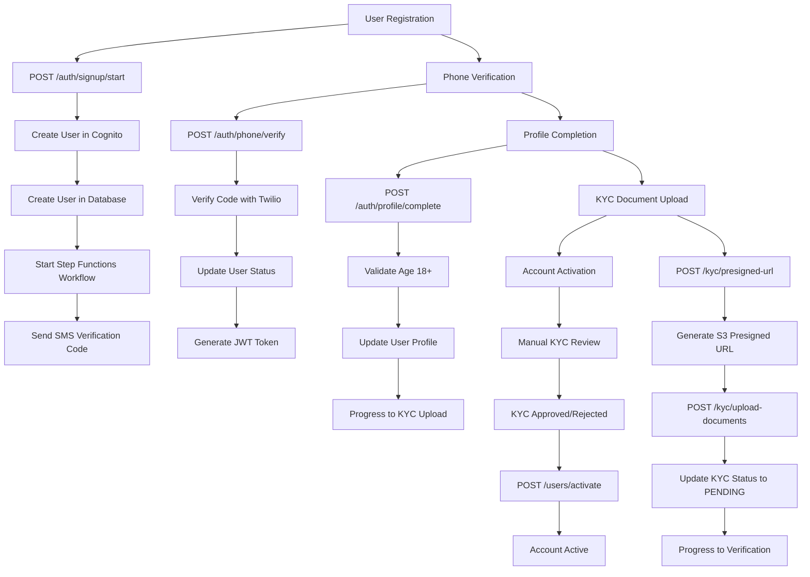

# 🚀 User Onboarding Flow - Complete 4-Phase Implementation

## Overview

The Car Rental Platform implements a comprehensive 4-phase user onboarding flow with AWS Step Functions integration for asynchronous KYC processing. This document outlines the complete implementation with API endpoints, data flow, and integration points.

## 📋 Flow Diagram



## 🔗 Phase-by-Phase Implementation

### Phase 1: User Registration & Phone Verification

**🎯 Goal**: Create user account and verify phone number

#### 1.1 Start Signup Process
- **Endpoint**: `POST /auth/signup/start`
- **Description**: Creates user in AWS Cognito and database
- **Triggers**: AWS Step Functions workflow
- **Response**: User ID and execution ARN

```json
{
  "email": "user@example.com",
  "password": "Password123!",
  "phoneNumber": "+1234567890",
  "firstName": "John",
  "lastName": "Doe"
}
```

#### 1.2 Send Verification Code
- **Endpoint**: `POST /auth/phone/send-code`
- **Description**: Sends SMS verification code
- **Service**: Twilio Verify (or Mock for development)

#### 1.3 Verify Phone Number
- **Endpoint**: `POST /auth/phone/verify`
- **Description**: Verifies SMS code and issues JWT
- **Access**: Public (can be called without authentication)
- **Response**: JWT access token for authenticated requests

```json
{
  "phoneNumber": "+1234567890",
  "code": "123456"
}
```

### Phase 2: Profile Completion

**🎯 Goal**: Collect complete user profile information

#### 2.1 Complete Profile
- **Endpoint**: `POST /auth/profile/complete`
- **Description**: Collects personal details and address
- **Validation**: Age must be 18+
- **Authentication**: Required (JWT token)

```json
{
  "firstName": "John",
  "lastName": "Doe",
  "dateOfBirth": "1990-01-15",
  "address": "123 Main Street",
  "city": "New York",
  "state": "NY",
  "postalCode": "10001",
  "country": "US",
  "driverLicense": "D123456789",
  "role": "RENTER"
}
```

### Phase 3: KYC Document Upload

**🎯 Goal**: Upload and submit identity documents for verification

#### 3.1 Get Presigned URL
- **Endpoint**: `POST /kyc/presigned-url`
- **Description**: Generates S3 presigned URL for direct upload
- **Authentication**: Required

```json
{
  "documentType": "DRIVERS_LICENSE",
  "side": "front",
  "fileExtension": "jpg"
}
```

#### 3.2 Upload Documents
- **Endpoint**: `POST /kyc/upload-documents`
- **Description**: Submit document URLs after S3 upload
- **Process**: Updates KYC status to PENDING

```json
{
  "documents": [{
    "documentType": "DRIVERS_LICENSE",
    "frontImageUrl": "https://s3.amazonaws.com/bucket/doc_front.jpg",
    "backImageUrl": "https://s3.amazonaws.com/bucket/doc_back.jpg",
    "notes": "High quality scan"
  }]
}
```

#### 3.3 Check KYC Status
- **Endpoint**: `GET /kyc/status`
- **Description**: Get current verification status
- **Response**: KYC status and uploaded documents

### Phase 4: Account Activation

**🎯 Goal**: Final account activation after KYC approval

#### 4.1 Get User Profile
- **Endpoint**: `GET /users/profile`
- **Description**: Retrieve current user information
- **Includes**: KYC status, account active status

#### 4.2 Activate Account
- **Endpoint**: `POST /users/activate`
- **Description**: Activate account after KYC verification
- **Requirement**: KYC status must be VERIFIED

#### 4.3 Check Onboarding Progress
- **Endpoint**: `GET /users/onboarding/progress`
- **Description**: Get complete onboarding status
- **Response**: Current step, completed steps, progress percentage

## 🛠️ AWS Step Functions Integration

### Workflow Definition
Located in: `src/infrastructure/workflows/step-function-definitions/user-onboarding.json`

### Key States:
1. **PhoneVerification** - Validates phone number
2. **WaitForProfileCompletion** - Waits for user to complete profile
3. **StartKYCVerification** - Initiates KYC process
4. **WaitForKYCApproval** - Manual approval step
5. **SendKYCApprovedNotification** - Success notification
6. **SendKYCRejectedNotification** - Rejection notification

### Service Integration:
- **Development**: Mock services for all integrations
- **Testing**: Configurable real/mock services via environment
- **Production**: Full AWS services (Cognito, Step Functions, S3)

## 📊 Status Tracking Endpoints

### Authentication Status
- `GET /auth/profile` - Current user profile
- `GET /auth/onboarding/status` - Onboarding progress with execution ARN

### Progress Monitoring
- `GET /users/onboarding/progress` - Detailed progress with percentage
- `GET /kyc/status` - KYC verification status and documents

## 🔧 Environment Configuration

### Development (.env.development)
```env
NODE_ENV=development
NOTIFICATION_PROVIDER=mock
AUTH_PROVIDER=mock
WORKFLOW_PROVIDER=mock
```

### AWS Testing (.env.testing.aws)
```env
NODE_ENV=development
NOTIFICATION_PROVIDER=twilio
AUTH_PROVIDER=cognito
WORKFLOW_PROVIDER=step-functions
AWS_STEP_FUNCTIONS_ONBOARDING_ARN=arn:aws:states:...
```

## 🚨 Error Handling

### Common Error Responses:
- **400 Bad Request**: Invalid input or business rule violation
- **401 Unauthorized**: Invalid or expired JWT token
- **409 Conflict**: User already exists
- **404 Not Found**: Resource not found

### Business Rules:
- Users must be 18+ to complete profile
- Phone verification required before profile completion
- Profile completion required before KYC upload
- KYC verification required before account activation

## 🧪 Testing

### Complete Flow Test Script
Run the comprehensive test: `./test-complete-onboarding-flow.sh`

### Manual Testing Sequence:
1. Start signup with valid email/password
2. Verify phone with code "123456" (mock)
3. Complete profile with valid data
4. Get presigned URL and upload documents
5. Check progress and activate account

## 🎯 Next Steps for Production

1. **AWS Deployment**:
   - Deploy Step Functions state machine
   - Configure real S3 bucket for documents
   - Set up Cognito User Pool

2. **KYC Integration**:
   - Implement admin dashboard for KYC review
   - Add automated document verification (AI/ML)
   - Configure notification delivery

3. **Monitoring**:
   - CloudWatch logging for Step Functions
   - Performance monitoring
   - Error alerting

## ✅ Implementation Status

- ✅ **Phase 1**: User Registration & Phone Verification
- ✅ **Phase 2**: Profile Completion  
- ✅ **Phase 3**: KYC Document Upload
- ✅ **Phase 4**: Account Activation
- ✅ **AWS Integration**: Step Functions workflow
- ✅ **Clean Architecture**: Consistent folder structure
- ✅ **Environment Config**: Mock and real service providers
- ✅ **Testing**: Complete flow test script

**🚀 Ready for production deployment!**
